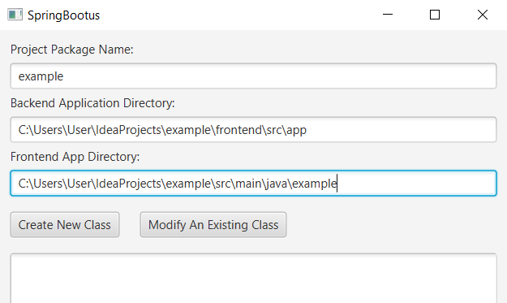
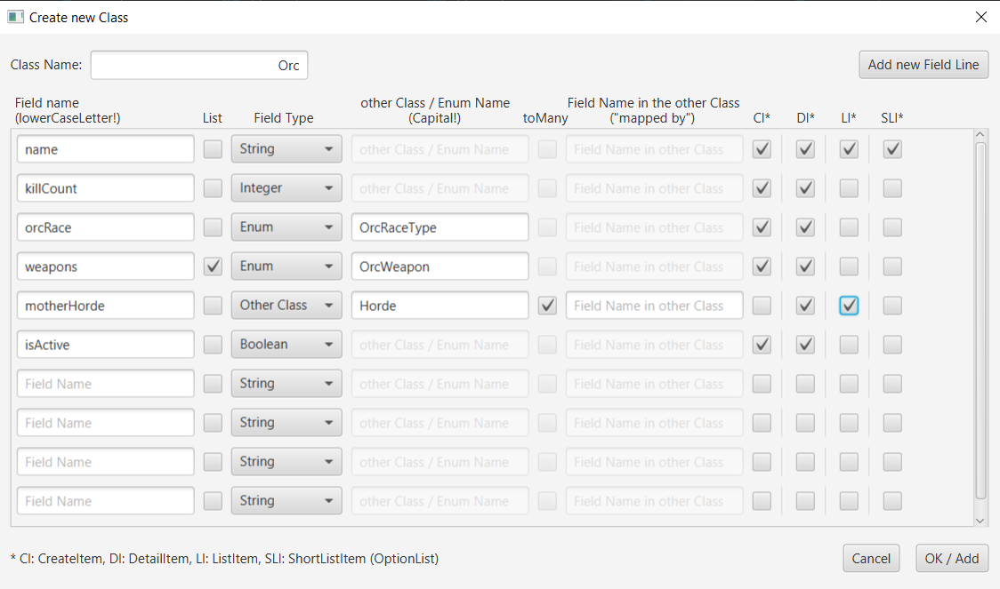
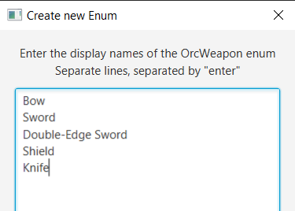
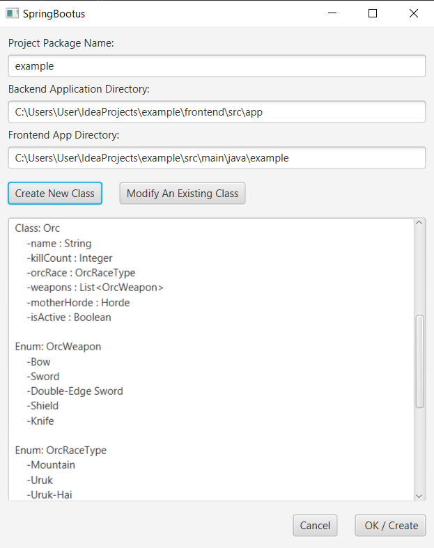

# SpringBootus

Create Angular frontend and Java11/SpringBoot backend based on a given domain structure

## Technologies used
`Java11` `Spring Boot` `SQL` `JPA` `Hibernate` `HTML/CSS` `Bootstrap` `JavaScript` `TypeScript` `Angular` `JavaFX`

## To get started, you need:
**for the backend:**
- An empty spring boot application from https://start.spring.io/ 
  - Language: `Java 11`
  - Build: `Maven`
  - Dependencies: 
    - `WEB / Spring Web`
    - `SQL / Spring Data JPA`
    - and a dependency required for the database you want to use, for example: `SQL / MySQL Driver`
- A blank schema in your database for the project that will need to be set in the `application.yaml` or `application.properties` file

**for the frontend:**
- New empty `angular-frontend` project with `app-routing`, installed `bootstrap` and `jquery`.

## How it works
**1.** You must first enter the name of the Java package, the absolute path to the backend application directory, and the fronend app directory.<br><br>


**2.** And then you need to create the domain classes.<br><br>

- `Class Name:` Name of the domain class
- `Field Name:` Name of the class field. The `id` field is generated automatically.
- `List:` Check it if you want to use this field as a list. E.g if more than one item can be selected from predefined values (Enum List) or for a OneToMany relationship.
- `Field Type:` Type of the field. You can choose from the following (under construction):
  - `String` Short, one line text
  - `Integer` `Long` `Double` Numbers
  - `Boolean` Boolean (True or False)
  - `Date Time` Date (year, month, day)
  - `Enum` Use enums for predefined values.
  - `Other Class` Use this for a OneToOne, OneToMany and ManyToOne relation.
  - `Image URL` The URL of the image to display on the page.
  - `Text Area` Longer, more lines of text
- `other Class/Enum Name:` If you chose Enum or Other Class, you can enter the class name here.
- `toMany:` Check to create a OneToMany or ManyToOne relationship. Leave unchecked if you want a OneToOne relationship.
- `Field Name in the other Class:` Use for OneToMany relationship (in the class where the field is a list). The name of the linked ("mappedBy") field in the other class must be specified.

**3.** If you specified an enum when creating the class, you must define the enum display names (as you would like them to appear on the page).<br><br>


**4.** And done, that's it!<br><br>



## Generated files and directories:
With `Example` Domain Class and `SampleEnum` Enum Class ( we use enums for predefined values )

- **frontend/src/app/**
```
├── components
│   ├── navbar
│   │   ├── navbar.component.css (navbar component)
│   │   ├── navbar.component.html
│   │   └── navbar.component.ts
│   ├── example-detail (component with details of the selected item)
│   │   ├── example-detail.component.css
│   │   ├── example-detail.component.html
│   │   └── example-detail.component.ts
│   ├── example-form (component for create and update item)
│   │   ├── example-form.component.css
│   │   ├── example-form.component.html
│   │   └── example-form.component.ts
│   └── example-list (component with items list view)
│       ├── example-list.component.css
│       ├── example-list.component.html
│       └── example-list.component.ts
├── models
│   ├── ExampleCreateItem.model.ts
│   ├── ExampleDetailItem.model.ts
│   ├── ExampleFormData.model.ts (if Class has Enum field)
│   ├── ExampleListItem.model.ts
│   ├── ExampleShortListItem.model.ts (if Class is a filed in the other Class)
│   └── SampleEnumOption.model.ts
├── services
│   └── Example.service.ts
├── app.component.css (override)
├── app.component.html (override)
├── app.component.ts (override)
├── app.module.ts (override)
└── app-routing.module.ts (override)
```
- **backend/ \***
```
├── config
│   └── SpringWebConfig.java (CORS policy)
├── controller
│   └── ExampleController.java **
├── domain
│   ├── Example.java
│   └── SampleEnum.java
├── dto
│   ├── ExampleCreateItem.java
│   ├── ExampleDetailItem.java
│   ├── ExampleFormData.java (if Class has Enum field)
│   ├── ExampleListItem.java
│   ├── ExampleShortListItem.java (if Class is a filed in the other Class)
│   └── SampleEnumOption.java
├── exception (for validation - under construction!)
│   ├── ApiError.java
│   ├── GlobalExceptionHandler.java
│   └── ValidationError.java
├── repository
│   └── ExampleRepository.java
├── service
│   └── ExampleService.java
├── validator (this function under construction!)
│   └── ExampleValidator.java
└── "ProjectName"Application.java (override)
```
**\* Controller-Service-Repository model:**<br>
The program generates a simplified `Controller`-`Service`-`Repository` model without any interfaces or any mappers. Mapping between DTO and Domain objects takes place in the DTO and Domain constructor (depending on the direction).

**\*\* HTTP requests handled by the controller:**
- `@GetMapping("/formData")` Preliminary data required to create a new item (predefined selectable values)
- `@PostMapping` Create a new item
- `@PutMapping("/{id}")` Update the item with the specified id
- `@DeleteMapping("/{id}")` Delete the item with the specified id
- `@GetMapping` Get list of existing items
- `@GetMapping("/{id}")` Get details of the items with the specified id
- `@GetMapping("/formData/{id}")` Preliminary data required to modify/update the item (with the specified id)


